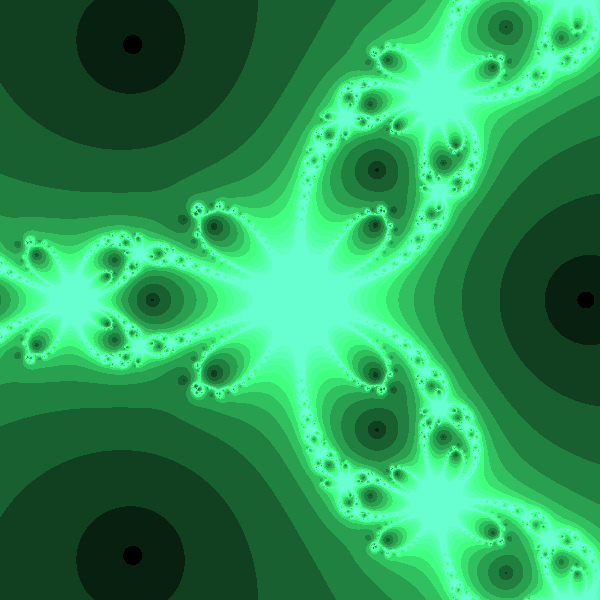

# Galeria de fractales 
Jessika Lizzeth Santos Lopez 

## Conjunto de Newton:
### Para este fractal la función utilizada es f(z)=z^4-5z^2-1. 
#### Sus raices complejas son 4: (-2.28-0i), (0-0.44i), (0+0.44i), (2.28-0i).


### Para este fractal la función utilizada es f(z)=z^3+z^2-6. 
#### Sus raices complejas son 3: (-1.27-1.51i), (-1.27+1.51i), (1.54+0i).


### Para este fractal la función utilizada es f(z)=z^5+6z^3-6. 
#### Sus raices complejas son 4: 



### Para este fractal la función utilizada es f(z)=z^5+5z^4-3z^3-5z^2+3z-8. 
#### Sus raices complejas son 4: 


### Para este fractal la función utilizada es f(z)=(z^5-3z^4-5z-66)/(100).
#### Sus raices complejas son 5: (-1.45-1.21i), (-1.45+1.21i), (1.19-1.95i), (1.19+1.95i), (3.54-0i).


## Algoritmo usual:
````
import matplotlib.pyplot as plt
from PIL import Image
imgx=600
imgy=500
image=Image.new("RGB",(imgx,imgy))
xa=-1
xb=1
ya=-1
yb=1
maxit=14
h=1e-6
eps=1e-3
def f(z):
    return z**4-5*z**2-1
for y in range (imgy):
    zy=y*(yb-ya)/(imgy-1)+ya
    for x in range (imgx):
        zx=x*(xb-xa)/(imgx-1)+xa
        z=complex(zx,zy)
        for i in range (maxit):
            dz=(f(z+complex(h,h))-f(z))/complex(h,h)
            z0=z-f(z)/dz
            if abs (z0-z)<eps:
                break
            z=z0
            r=i*12
            g=i*10
            b=i*15
            image.putpixel((x,y),(r,g,b))
image
````
 [Algoritmo interactivo para fractales de Newton](Interact_Newton.html)

