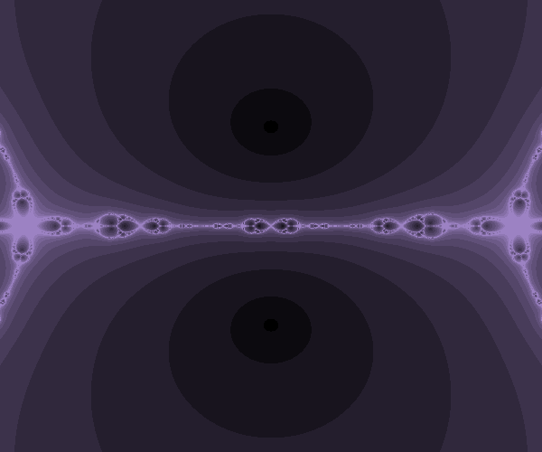
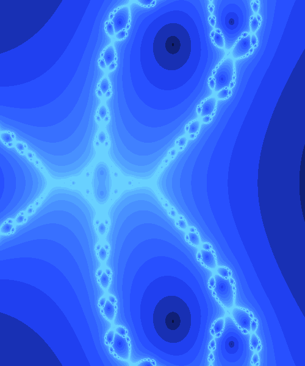

# Galeria de fractales 
Jessika Lizzeth Santos Lopez 

## Conjunto de Newton:
* Para este fractal la función utilizada es f(z)=z^4-5z^2-1. 
* Sus raices complejas son 4: (-2.28-0i), (0-0.44i), (0+0.44i), (2.28-0i).



* Para este fractal la función utilizada es f(z)=z^3+z^2-6. 
* Sus raices complejas son 3: (-1.27-1.51i), (-1.27+1.51i), (1.54+0i).



* Para este fractal la función utilizada es f(z)=z^5+6z^3-6. 
* Sus raices complejas son 5: (-0.56-0.85i), (-0.56+0.85i), (0.08-2.46i), (0.08+2.46i), (0.95+0i).


* Para este fractal la función utilizada es f(z)=z^5+5z^4-3z^3-5z^2+3z-8. 
* Sus raices complejas son 5: (-5.36+0i), (-1.4+0i), (0.21-0.87i), (0.21+0.87i), (1.33+0i).


* Para este fractal la función utilizada es f(z)=(z^5-3z^4-5z-66)/(100).
* Sus raices complejas son 5: (-1.45-1.21i), (-1.45+1.21i), (1.19-1.95i), (1.19+1.95i), (3.54-0i).


## Algoritmo usual para los fractales de Newton:
````
import matplotlib.pyplot as plt
from PIL import Image
imgx=600
imgy=500
image=Image.new("RGB",(imgx,imgy))
xa=-1
xb=1
ya=-1
yb=1
maxit=14
h=1e-6
eps=1e-3
def f(z):
    return z**4-5*z**2-1
for y in range (imgy):
    zy=y*(yb-ya)/(imgy-1)+ya
    for x in range (imgx):
        zx=x*(xb-xa)/(imgx-1)+xa
        z=complex(zx,zy)
        for i in range (maxit):
            dz=(f(z+complex(h,h))-f(z))/complex(h,h)
            z0=z-f(z)/dz
            if abs (z0-z)<eps:
                break
            z=z0
            r=i*12
            g=i*10
            b=i*15
            image.putpixel((x,y),(r,g,b))
image
````


## Conjuntos de Julia:
* Para este fractal de Julia la función utilizada es f(z)=z^5+3z^3+complex(2,1).


* Para este fractal de Julia la función utilizada es f(z)=z^3+3z^2-complex(1.88,1.333).


* Para este fractal de Julia la función utilizada es f(z)=z^5+complex(0.5,0.9).


* Para este fractal de Julia la función utilizada es f(z)=z^5-1+complex(0.01,0.09).


## Algoritmo usual para fractales de Julia:
````
import matplotlib.pyplot as plt
from PIL import Image
imgx=400
imgy=400
image=Image.new("RGB",(imgx,imgy))
image.putpixel((100,100),(255,255,255))
xa=-2
xb=2
ya=-2
yb=2
maxit=30
def f(z):
    return z**5+3*z**3+complex(2,1)

for y in range (imgy):
    zy=y*(yb-ya)/(imgy-1)+ya
    for x in range (imgx):
        zx=x*(xb-xa)/(imgx-1)+xa
        z=complex(zx,zy)
        for i in range (maxit):
            z0=f(z)
            if abs(z)>1000:
                break
            z=z0
            r=i*10
            g=i*50
            b=i*90
            image.putpixel((x,y),(r,g,b))
image
````

## Sistemas interados de funciones:
* Este fractal interado se llama Koch-Snowflake con una cantidad de 3 iteraciones.


* Este fractal interado se llama Rings con una cantidad de 3 iteraciones.


* Este fractal interado se llama Siepinski-Sieve con una cantidad de 4 iteraciones.


* Este fractal interado se llama Crystal con una cantidad de 3 iteraciones.


## Algoritmo usual para fractales iterativos:
````
import turtle
##Siepinski-Sieve
def create_l_system(iters, axiom, rules):
    start_string = axiom
    if iters == 0:
        return axiom
    end_string = ""
    for _ in range(iters):
        end_string = "".join(rules[i] if i in rules else i for i in start_string)
        start_string = end_string

    return end_string


def draw_l_system(t, instructions, angle, distance):
    for cmd in instructions:
        if cmd == 'F':
            t.forward(distance)
        elif cmd == '+':
            t.right(angle)
        elif cmd == '-':
            t.left(angle)


def main(iterations, axiom, rules, angle, length=8, size=2, y_offset=-20,
        x_offset=0, offset_angle=0, width=450, height=450):

    inst = create_l_system(iterations, axiom, rules)

    t = turtle.Turtle()
    wn = turtle.Screen()
    wn.setup(width, height)

    t.up()
    t.backward(-x_offset)
    t.left(90)
    t.backward(-y_offset)
    t.left(offset_angle)
    t.down()
    t.speed(0)
    t.pensize(size)
    draw_l_system(t, inst, angle, length)
    t.hideturtle()

    wn.exitonclick()
axiom = "FXF--FF--FF"
rules = {"F":"FF", "X":"--FXF++FXF++FXF--"}
iterations = 4
angle = 60
main(iterations, axiom, rules, angle)

````

## Herramienta interactiva para el algoritmo de los fractales de Newton:

### [Algoritmo interactivo para fractales de Newton](Interact_Newton.html)

## Anexo de documentación de la experiencia 
### [Documentación](Documentación.html)
